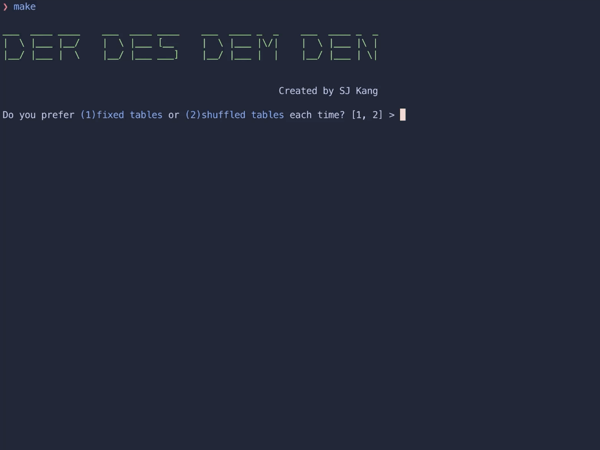
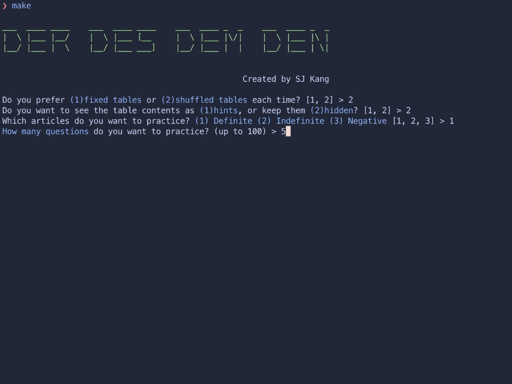

# derdesdemden-swift

Have you finished practicing German 🇩🇪 noun genders with [derdiedas-c](https://github.com/kangsjin/derdiedas-c)?

Now it's time to practice the articles. 🙌

If you want to beat the man in [this video](https://youtu.be/saUEYKiDF5c?si=GKJR45HNj4poy4Wh&t=47), practice articles with this command-line program. 😎

Übung macht den Meister. Toi toi toi!

## Build & Run

```bash
make
```

⚠️ **Requirements**: Ensure that `swiftc` is available in your runtime environment for successful build and execution.

## Quiz Options

- You can keep the table fixed or shuffle it with each quiz.
- You can choose whether or not to see other articles as hints.
- You can choose between definite, indefinite, and negative articles.
- You can practice up to 100 quizzes at a time.

## Examples

- Fixed table + hints + definite
  

- Shuffled table + no hints + definite
  
